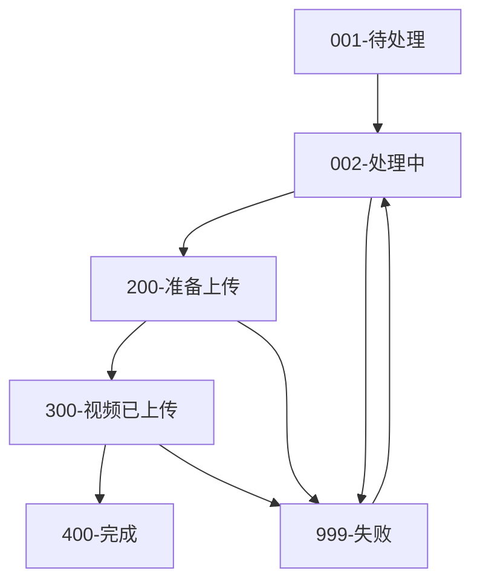

# YTB2BILI - YouTube 到 Bilibili 自动化转载系统

一个功能完整的视频自动化处理系统，支持从 YouTube 等平台下载视频，自动生成字幕、翻译内容、生成元数据，并定时上传到 Bilibili。

## ✨ 核心功能

### 🎬 智能视频处理链

**4步准备流程（实时处理）**：
1. **🎬 字幕生成** - 使用 Whisper AI 自动生成高质量字幕
2. **📷 封面下载** - 自动下载并上传高清封面到云存储
3. **🌐 字幕翻译** - 支持百度翻译和 DeepSeek AI 多语言翻译
4. **🤖 元数据生成** - AI 分析视频内容，生成符合 B站规范的标题、描述、标签

**定时上传策略（智能调度）**：
- **🎥 视频上传** - 每小时上传一个处理完成的视频
- **📝 字幕上传** - 视频上传成功后1小时自动上传字幕

### 📊 可视化管理面板
- **📋 视频列表** - 实时查看所有视频的处理状态
- **🔍 详细信息** - 完整的视频信息和处理步骤追踪  
- **🎯 单步重试** - 支持重新执行失败的任务步骤
- **📈 进度监控** - 实时进度百分比和处理时长统计
- **📁 文件管理** - 查看和下载所有生成的文件（视频、字幕、封面等）

### 🔐 B站账户集成
- **📱 扫码登录** - 支持 Bilibili TV 扫码快速登录
- **🖼️ 二维码生成** - 后端自动生成 PNG 格式登录二维码
- **🔄 自动检测** - 前端实时轮询检测登录状态
- **👤 用户信息** - 获取并展示用户名、头像等信息
- **💾 状态持久化** - 自动保存登录 Token 和 Cookie
- **⚡ 状态检查** - 智能检测账户登录状态

---

## 🏗️ 技术架构

### 🖥️ 后端技术栈
- **语言**: Go 1.24+ (支持最新语言特性)
- **Web 框架**: Gin (高性能HTTP框架)
- **ORM**: GORM v2 (支持多数据库)
- **数据库**: MySQL 8.0+ / PostgreSQL 15+ / SQLite (开发环境)
- **文件存储**: 腾讯云 COS (支持大文件分片上传)
- **依赖注入**: Uber FX (声明式依赖管理)
- **定时任务**: Robfig Cron v3 (精确到秒级调度)
- **日志**: Zap + Lumberjack (结构化日志和日志轮转)

### 🌐 前端技术栈 
- **框架**: Next.js 15+ (支持 App Router)
- **语言**: TypeScript 5.x (完全类型安全)
- **UI 库**: React 18 + Tailwind CSS 3.x
- **图标**: Lucide React (现代化图标库)
- **HTTP 客户端**: Axios (支持请求拦截和重试)
- **构建**: 静态导出 + 嵌入式部署

### 🔗 外部服务集成
- **🎤 yt-dlp** - 多平台视频下载 (YouTube, TikTok, 等)
- **🧠 Whisper AI** - 高精度语音识别和字幕生成
- **🌐 百度翻译 API** - 专业机器翻译服务
- **🤖 DeepSeek AI** - 先进的AI翻译和内容生成
- **📺 Bilibili SDK** - 官方视频上传和用户认证API
- **☁️ 腾讯云 COS** - 企业级对象存储服务
- **📊 数据分析** - 可选的用户行为分析和统计

---

## 📁 项目结构

```
ytb2bili/
├── main.go                      # 🚀 应用程序入口和依赖注入配置
├── Makefile                     # 📦 自动化构建脚本 (前端+后端一键打包)
├── config.toml                  # ⚙️ 主配置文件
├── config.toml.example          # 📋 配置文件模板
├── go.mod                       # 📦 Go 模块依赖管理
└── README.md                    # 📖 项目文档

internal/                        # 🏠 内部业务逻辑
├── chain_task/                  # ⛓️ 任务链处理引擎
│   ├── chain_task_handler.go    # 任务链执行器 (准备阶段: 字幕生成→翻译→元数据)
│   ├── upload_scheduler.go      # 上传调度器 (定时上传: 视频→字幕)
│   ├── base/
│   │   └── base_task.go         # 任务基类
│   ├── handlers/                # 🔧 具体任务处理器
│   │   ├── generate_subtitles.go      # 字幕生成 (Whisper AI)
│   │   ├── translate_subtitle.go      # 字幕翻译 (百度/DeepSeek)
│   │   ├── generate_metadata.go       # 元数据生成 (AI标题描述)
│   │   ├── download_img_handler.go    # 封面下载处理
│   │   ├── upload_to_bilibili.go      # 视频上传到B站
│   │   ├── upload_subtitle_to_bilibili.go  # 字幕上传到B站
│   │   └── ...
│   └── manager/
│       ├── chain.go             # 任务链管理
│       └── state.go             # 状态管理
├── core/                        # 🎯 核心业务层
│   ├── app_server.go            # HTTP 服务器配置
│   ├── models/                  # 📊 数据模型
│   │   ├── tb_video.go          # 视频表模型
│   │   ├── tb_task_step.go      # 任务步骤模型
│   │   ├── tb_user.go           # 用户模型
│   │   └── ...
│   ├── services/                # 🔄 业务服务层
│   │   ├── tb_video_service.go  # 视频业务逻辑
│   │   ├── task_step_service.go # 任务步骤管理
│   │   └── saved_video_service.go
│   └── types/
│       ├── app_config.go        # 应用配置定义
│       └── task_interface.go    # 任务接口定义
├── handler/                     # 🌐 HTTP 请求处理器
│   ├── auth_handler.go          # 认证相关 API
│   ├── video_handler.go         # 视频管理 API
│   ├── upload_handler.go        # 上传相关 API
│   ├── subtitle_handler.go      # 字幕处理 API
│   └── ...
├── storage/                     # 💾 存储抽象层
│   ├── interfaces.go            # 存储接口定义
│   └── login_store.go           # 登录状态存储
└── web/                         # 🌟 内嵌前端资源
    ├── static.go                # 静态文件服务器
    └── bili-up-web/             # Next.js 编译后的静态文件
        ├── index.html           # 前端入口页面
        ├── _next/               # Next.js 静态资源
        └── ...

pkg/                             # 📚 可重用组件库
├── analytics/                   # 📊 数据分析客户端
│   ├── client.go
│   └── middleware.go
├── cos/                         # ☁️ 腾讯云COS存储客户端
│   ├── cos_client.go
│   ├── cos_handler.go
│   └── download_utils.go
├── logger/                      # 📝 日志组件
│   └── logger.go
├── services/                    # 🛠️ 通用服务
│   └── subtitle_service.go
├── store/                       # 🗃️ 数据库操作
│   ├── database.go              # 数据库连接
│   ├── migrate.go               # 数据库迁移
│   └── model/                   # 数据库模型
├── translator/                  # 🌐 翻译服务
│   ├── baidu_translator.go      # 百度翻译
│   ├── deepseek_translator.go   # DeepSeek翻译
│   ├── factory.go               # 翻译器工厂
│   └── manager.go               # 翻译管理器
└── utils/                       # 🧰 工具函数
    ├── crypto.go                # 加密工具
    ├── ffmpeg_utils.go          # 视频处理工具
    ├── youtube_utils.go         # YouTube工具
    ├── ytdlp_manager.go         # yt-dlp管理器
    └── ...
```

---

## 🚀 快速开始

### ⚡ 一键部署 (推荐)

```bash
# 克隆项目 (需要前端项目在同级目录)
git clone https://github.com/difyz9/ytb2bili.git
cd ytb2bili/bili-up-api

# 一键构建 (自动构建前端+后端并打包成单个可执行文件)
make build

# 启动服务
./bili-up-api-server
```

🎉 **就这么简单！** 访问 `http://localhost:8096` 即可使用完整功能。

> **💡 构建原理**: `make build` 会自动完成以下步骤：
> 1. 🔧 构建 Next.js 前端 (`npm run build`)
> 2. 📦 将静态文件嵌入到 Go 二进制中
> 3. 🚀 编译生成单个可执行文件 (约 50MB)
> 4. ✅ 零依赖部署，开箱即用

### 📋 环境要求

| 组件 | 版本要求 | 用途 |
|------|----------|------|
| **Go** | 1.24+ | 后端运行环境 |
| **Node.js** | 18+ | 前端构建 (仅构建时需要) |
| **数据库** | MySQL 8.0+ / PostgreSQL 15+ / SQLite | 数据存储 |
| **yt-dlp** | 最新版 | 视频下载 (自动安装) |

### ⚙️ 配置设置

#### 1. 数据库准备

**MySQL (推荐生产环境)**:
```sql
CREATE DATABASE ytb2bili CHARACTER SET utf8mb4 COLLATE utf8mb4_unicode_ci;
CREATE USER 'ytb2bili'@'localhost' IDENTIFIED BY 'your_secure_password';
GRANT ALL PRIVILEGES ON ytb2bili.* TO 'ytb2bili'@'localhost';
FLUSH PRIVILEGES;
```

**SQLite (适用开发环境)**:
无需额外配置，程序会自动创建数据库文件。

#### 2. 配置文件设置

```bash
# 复制配置模板
cp config.toml.example config.toml

# 编辑配置文件
nano config.toml
```

**基础配置**:
```toml
# 服务配置
listen = ":8096"                    # 服务监听端口
environment = "production"           # 运行环境
debug = false                       # 生产环境建议关闭
FileUpDir = "/data/ytb2bili/media"  # 文件存储目录 (需要足够磁盘空间)

# 数据库配置
[database]
  type = "mysql"                    # mysql / postgres / sqlite
  host = "localhost"
  port = 3306
  username = "ytb2bili"
  password = "your_secure_password"
  database = "ytb2bili"
  timezone = "Asia/Shanghai"
```

**云存储配置 (推荐)**:
```toml
# 腾讯云 COS - 用于存储视频和封面
[TenCosConfig]
  enabled = true
  CosBucketURL = "https://your-bucket.cos.ap-guangzhou.myqcloud.com"
  CosSecretId = "您的SecretId"
  CosSecretKey = "您的SecretKey"
  CosRegion = "ap-guangzhou"
  CosBucket = "your-bucket"
  SubAppId = "您的AppId"
```

**翻译服务配置**:
```toml
# 可通过 Web 界面动态配置，无需在此设置
# - 百度翻译: 在系统设置中配置 App ID 和密钥
# - DeepSeek AI: 在系统设置中配置 API Key
```

### 🔄 其他启动方式

**开发模式** (代码变更自动重启):
```bash
# 安装 air 工具
go install github.com/cosmtrek/air@latest

# 开发模式运行
make dev
```

**仅构建后端** (跳过前端构建):
```bash
make build-api
./bili-up-api-server
```

**生产优化构建**:
```bash
make build-prod  # 启用编译优化，减小文件大小
```

---

## 📖 API 文档

### 🎬 视频管理 API

<details>
<summary><strong>📋 获取视频列表</strong></summary>

```http
GET /api/v1/videos?page=1&pageSize=20&status=all
```

**查询参数**:
- `page`: 页码 (默认: 1)
- `pageSize`: 每页数量 (默认: 20, 最大: 100)
- `status`: 状态筛选 (`all`, `pending`, `processing`, `completed`, `failed`)

**响应示例**:
```json
{
  "code": 200,
  "message": "success",
  "data": {
    "videos": [
      {
        "id": 1,
        "video_id": "dQw4w9WgXcQ",
        "title": "Never Gonna Give You Up",
        "status": "completed",
        "created_at": "2024-01-15T10:30:00Z",
        "bilibili_bvid": "BV1xx411c7mD",
        "progress": 100
      }
    ],
    "total": 150,
    "page": 1,
    "page_size": 20
  }
}
```
</details>

<details>
<summary><strong>🔍 获取视频详情 (含任务步骤)</strong></summary>

```http
GET /api/v1/videos/:id
```

**响应示例**:
```json
{
  "code": 200,
  "data": {
    "video": {
      "id": 1,
      "video_id": "dQw4w9WgXcQ",
      "title": "Never Gonna Give You Up",
      "description": "经典音乐视频...",
      "status": "completed",
      "bilibili_bvid": "BV1xx411c7mD"
    },
    "task_steps": [
      {
        "step_name": "生成字幕",
        "step_order": 1,
        "status": "completed",
        "duration": 45,
        "can_retry": false,
        "start_time": "2024-01-15T10:30:00Z",
        "end_time": "2024-01-15T10:30:45Z"
      },
      {
        "step_name": "翻译字幕", 
        "step_order": 2,
        "status": "completed",
        "duration": 12
      }
    ]
  }
}
```
</details>

<details>
<summary><strong>🔄 重试任务步骤</strong></summary>

```http
POST /api/v1/videos/:id/steps/:stepName/retry
```

**路径参数**:
- `id`: 视频ID
- `stepName`: 步骤名称 (`生成字幕`, `翻译字幕`, `生成视频元数据`, `上传到Bilibili`, `上传字幕到Bilibili`)
</details>

<details>
<summary><strong>📁 获取视频文件列表</strong></summary>

```http
GET /api/v1/videos/:id/files
```

**响应示例**:
```json
{
  "code": 200,
  "data": {
    "video_file": "/data/videos/dQw4w9WgXcQ/video.mp4",
    "subtitle_files": [
      "/data/videos/dQw4w9WgXcQ/subtitle.srt",
      "/data/videos/dQw4w9WgXcQ/subtitle_zh.srt"
    ],
    "cover_image": "/data/videos/dQw4w9WgXcQ/cover.jpg",
    "metadata_file": "/data/videos/dQw4w9WgXcQ/metadata.json"
  }
}
```
</details>

<details>
<summary><strong>🚀 手动上传触发</strong></summary>

```http
POST /api/v1/videos/:id/upload/video     # 手动上传视频
POST /api/v1/videos/:id/upload/subtitle  # 手动上传字幕
```

**用途**: 绕过定时调度，立即执行上传任务
</details>

### 🔐 B站认证 API

<details>
<summary><strong>📱 获取登录二维码</strong></summary>

```http
GET /api/v1/auth/qrcode
```

**响应**:
```json
{
  "code": 200,
  "data": {
    "auth_code": "abc123...",
    "qrcode_url": "https://passport.bilibili.com/qrcode?code=abc123...",
    "expires_in": 180
  }
}
```
</details>

<details>
<summary><strong>🖼️ 获取二维码图片</strong></summary>

```http
GET /api/v1/auth/qrcode/image/:authCode
```

**响应**: PNG 图片数据 (Content-Type: image/png)
</details>

<details>
<summary><strong>🔄 轮询登录状态</strong></summary>

```http
POST /api/v1/auth/poll
Content-Type: application/json

{
  "auth_code": "abc123..."
}
```

**响应状态**:
- `waiting`: 等待扫码
- `scanned`: 已扫码，等待确认
- `success`: 登录成功
- `expired`: 二维码过期
</details>

<details>
<summary><strong>✅ 检查登录状态</strong></summary>

```http
GET /api/v1/auth/status
```

**响应**:
```json
{
  "code": 200,
  "data": {
    "is_logged_in": true,
    "user_info": {
      "username": "用户名",
      "avatar": "头像URL",
      "uid": 12345678
    }
  }
}
```
</details>

### 🎯 字幕处理 API

<details>
<summary><strong>💾 保存视频到处理队列</strong></summary>

```http
POST /api/v1/subtitles/save
Content-Type: application/json

{
  "url": "https://www.youtube.com/watch?v=dQw4w9WgXcQ",
  "title": "自定义标题 (可选)",
  "description": "自定义描述 (可选)",
  "operation_type": "auto_process"
}
```

**功能**: 将视频URL添加到处理队列，自动开始 4 步准备流程
</details>

### ⚙️ 系统配置 API

<details>
<summary><strong>🔧 动态配置管理</strong></summary>

```http
GET /api/v1/config              # 获取当前配置
POST /api/v1/config             # 更新配置 (百度翻译、DeepSeek等)
```

**支持动态配置的服务**:
- 百度翻译 (App ID, Secret Key)  
- DeepSeek AI (API Key, Model)
- 文件上传路径
- 调试开关等
</details>

---


## 🎯 智能处理流程

### ⚡ 4步准备阶段 (实时处理)

当你添加一个 YouTube 视频URL后，系统会立即开始以下处理流程：

| 步骤 | 处理器 | 功能描述 | 平均耗时 |
|------|--------|----------|----------|
| 1️⃣ | **字幕生成** | 🎤 Whisper AI 语音识别，生成高精度字幕文件 | 2-5分钟 |
| 2️⃣ | **封面下载** | 📷 下载高清封面图，上传到云存储获取CDN链接 | 10-30秒 |
| 3️⃣ | **字幕翻译** | 🌐 智能翻译字幕 (百度翻译/DeepSeek AI) | 30-60秒 |  
| 4️⃣ | **元数据生成** | 🤖 AI分析视频内容，生成符合B站规范的标题、描述、标签 | 30-90秒 |

> **💡 智能特性**:
> - 支持 **yt-dlp** 的所有平台 (YouTube, TikTok, Instagram, Twitter等)
> - 自动选择最佳视频质量 (1080p优先)
> - 智能跳过已存在的处理步骤
> - 失败自动重试机制 (最多3次)

### 🚀 定时上传阶段 (智能调度)

为了避免频繁上传被B站限制，系统采用智能调度策略：


| 阶段 | 调度策略 | 说明 |
|------|----------|------|
| 🎬 **视频上传** | 每小时1个 | 避免频繁上传，降低被限制风险 |
| 📝 **字幕上传** | 视频上传后1小时 | 确保视频审核通过后再上传字幕 |
| 🔄 **手动触发** | 立即执行 | Web界面支持跳过队列立即上传 |

### 📊 任务状态系统

| 状态 | 图标 | 描述 | 可操作 |
|------|------|------|--------|
| `pending` | ⏳ | 等待执行 | - |
| `running` | 🔄 | 正在执行 | - |
| `completed` | ✅ | 已完成 | ✓ 可查看结果 |
| `failed` | ❌ | 执行失败 | ✓ 可重试 |
| `skipped` | ⏭️ | 已跳过 | ✓ 可重新执行 |

### 🛡️ 容错机制

- **任务隔离**: 单个步骤失败不影响其他步骤
- **状态恢复**: 应用重启后自动恢复执行状态
- **重试策略**: 网络错误自动重试，其他错误手动重试
- **进度保存**: 每个步骤的执行结果都会持久化保存
- **资源管理**: 智能清理临时文件，避免磁盘空间不足

---

## 🧪 测试与验证

### 🚀 功能测试

**1. 健康检查**:
```bash
curl http://localhost:8096/health
# 预期响应: {"status":"ok","message":"Bili Up Backend API is running"}
```

**2. 完整流程测试**:
```bash
# 1. 检查登录状态
curl http://localhost:8096/api/v1/auth/status

# 2. 获取登录二维码 (如未登录)  
curl http://localhost:8096/api/v1/auth/qrcode

# 3. 添加视频到处理队列
curl -X POST http://localhost:8096/api/v1/subtitles/save \
  -H "Content-Type: application/json" \
  -d '{"url":"https://www.youtube.com/watch?v=dQw4w9WgXcQ","operation_type":"auto_process"}'

# 4. 查看处理进度
curl http://localhost:8096/api/v1/videos
```

### 🔧 开发测试

**运行单元测试**:
```bash
make test
# 或
go test -v ./...
```

**代码质量检查**:
```bash
make lint    # 代码规范检查
make fmt     # 代码格式化
```

**性能测试**:
```bash
# 并发API测试
ab -n 100 -c 10 http://localhost:8096/health

# 内存使用监控
go tool pprof http://localhost:8096/debug/pprof/heap
```

---

## 📊 数据库设计

### 核心表结构

<details>
<summary><strong>📹 tb_videos - 视频主表</strong></summary>

```sql
CREATE TABLE `tb_videos` (
  `id` bigint unsigned NOT NULL AUTO_INCREMENT COMMENT '主键',
  `video_id` varchar(100) NOT NULL COMMENT 'YouTube视频ID',
  `title` varchar(500) DEFAULT NULL COMMENT '视频标题',
  `description` text COMMENT '视频描述',
  `cover_url` varchar(1000) DEFAULT NULL COMMENT '封面图片URL', 
  `file_path` varchar(1000) DEFAULT NULL COMMENT '本地文件路径',
  `status` varchar(20) DEFAULT '001' COMMENT '处理状态: 001-待处理 002-处理中 200-准备上传 300-视频已上传 400-完成 999-失败',
  `bilibili_bvid` varchar(20) DEFAULT NULL COMMENT 'B站视频BV号',
  `bilibili_aid` bigint DEFAULT NULL COMMENT 'B站视频AV号',
  `created_at` timestamp NULL DEFAULT CURRENT_TIMESTAMP,
  `updated_at` timestamp NULL DEFAULT CURRENT_TIMESTAMP ON UPDATE CURRENT_TIMESTAMP,
  PRIMARY KEY (`id`),
  UNIQUE KEY `idx_video_id` (`video_id`),
  KEY `idx_status` (`status`),
  KEY `idx_created_at` (`created_at`)
) ENGINE=InnoDB DEFAULT CHARSET=utf8mb4 COMMENT='视频主表';
```
</details>

<details>
<summary><strong>📝 task_steps - 任务步骤表</strong></summary>

```sql
CREATE TABLE `task_steps` (
  `id` bigint unsigned NOT NULL AUTO_INCREMENT,
  `video_id` varchar(100) NOT NULL COMMENT '关联视频ID',
  `step_name` varchar(100) NOT NULL COMMENT '步骤名称',
  `step_order` int NOT NULL COMMENT '步骤顺序',
  `status` enum('pending','running','completed','failed','skipped') DEFAULT 'pending',
  `start_time` timestamp NULL DEFAULT NULL COMMENT '开始时间',
  `end_time` timestamp NULL DEFAULT NULL COMMENT '结束时间', 
  `duration` int DEFAULT NULL COMMENT '执行耗时(秒)',
  `error_msg` text COMMENT '错误信息',
  `result_data` json DEFAULT NULL COMMENT '执行结果数据',
  `can_retry` tinyint(1) DEFAULT '1' COMMENT '是否可重试',
  `created_at` timestamp NULL DEFAULT CURRENT_TIMESTAMP,
  `updated_at` timestamp NULL DEFAULT CURRENT_TIMESTAMP ON UPDATE CURRENT_TIMESTAMP,
  PRIMARY KEY (`id`),
  UNIQUE KEY `idx_video_step` (`video_id`,`step_name`),
  KEY `idx_status` (`status`)
) ENGINE=InnoDB DEFAULT CHARSET=utf8mb4 COMMENT='任务步骤表';
```
</details>

<details>
<summary><strong>👤 tb_users - 用户表</strong></summary>

```sql
CREATE TABLE `tb_users` (
  `id` bigint unsigned NOT NULL AUTO_INCREMENT,
  `username` varchar(100) NOT NULL COMMENT '用户名',
  `bilibili_uid` bigint DEFAULT NULL COMMENT 'B站UID',
  `avatar_url` varchar(500) DEFAULT NULL COMMENT '头像URL',
  `access_token` text COMMENT '访问令牌',
  `refresh_token` text COMMENT '刷新令牌',  
  `cookies` text COMMENT '登录Cookie',
  `login_status` tinyint(1) DEFAULT '0' COMMENT '登录状态',
  `last_login_at` timestamp NULL DEFAULT NULL,
  `created_at` timestamp NULL DEFAULT CURRENT_TIMESTAMP,
  `updated_at` timestamp NULL DEFAULT CURRENT_TIMESTAMP ON UPDATE CURRENT_TIMESTAMP,
  PRIMARY KEY (`id`),
  UNIQUE KEY `idx_bilibili_uid` (`bilibili_uid`)
) ENGINE=InnoDB DEFAULT CHARSET=utf8mb4 COMMENT='用户表';
```
</details>

### 状态流转图



### 索引优化

- **主键索引**: 所有表都有自增主键
- **唯一索引**: video_id, bilibili_uid 保证数据唯一性  
- **状态索引**: 按状态快速查询待处理任务
- **时间索引**: 按创建时间排序和分页
- **联合索引**: video_id + step_name 确保步骤唯一性

---

## 🛠️ 故障排查

### 🚫 常见问题

<details>
<summary><strong>❌ 数据库连接失败</strong></summary>

**错误现象**:
```
Error 1045: Access denied for user 'root'@'localhost'
panic: failed to connect to database
```

**解决方案**:
1. **检查配置文件**:
   ```bash
   cat config.toml | grep -A 10 "\[database\]"
   ```

2. **验证数据库服务**:
   ```bash
   # MySQL
   sudo systemctl status mysql
   mysql -u root -p -e "SELECT 1"
   
   # 或使用 SQLite (无需额外服务)
   # 修改 config.toml: type = "sqlite"
   ```

3. **创建数据库和用户**:
   ```sql
   CREATE DATABASE ytb2bili CHARACTER SET utf8mb4;
   CREATE USER 'ytb2bili'@'localhost' IDENTIFIED BY 'your_password';  
   GRANT ALL ON ytb2bili.* TO 'ytb2bili'@'localhost';
   ```
</details>

<details>
<summary><strong>📱 B站登录问题</strong></summary>

**问题1: 二维码无法显示**
```bash
# 检查二维码生成接口
curl http://localhost:8096/api/v1/auth/qrcode
```

**问题2: 扫码后无反应**
- 确保手机和服务器在同一网络
- 检查防火墙是否阻止了 8096 端口
- 尝试使用 B站 TV 版本扫码

**问题3: 登录状态丢失**
```bash
# 检查登录状态
curl http://localhost:8096/api/v1/auth/status

# 查看日志中的错误信息  
tail -f logs/app.log | grep -i "auth\|login"
```
</details>

<details>
<summary><strong>🎬 视频处理失败</strong></summary>

**问题1: yt-dlp 下载失败**
```bash
# 手动测试下载
yt-dlp "https://www.youtube.com/watch?v=dQw4w9WgXcQ" --list-formats

# 更新 yt-dlp 到最新版本
pip install --upgrade yt-dlp
```

**问题2: 字幕生成失败**
- 检查 Whisper 模型是否正确安装
- 确保有足够的内存 (推荐 4GB+)
- 查看具体错误信息重试

**问题3: 翻译服务不可用**
```bash
# 测试百度翻译配置
curl -X POST "https://fanyi-api.baidu.com/api/trans/vip/translate" \
  -d "q=hello&from=en&to=zh&appid=YOUR_APP_ID&salt=123&sign=YOUR_SIGN"

# 测试 DeepSeek API
curl -X POST "https://api.deepseek.com/chat/completions" \
  -H "Authorization: Bearer YOUR_API_KEY" \
  -d '{"model":"deepseek-chat","messages":[{"role":"user","content":"test"}]}'
```
</details>

<details>
<summary><strong>☁️ 云存储问题</strong></summary>

**问题1: 腾讯云COS上传失败**
```bash
# 检查COS配置
curl "https://your-bucket.cos.ap-guangzhou.myqcloud.com/"

# 验证密钥权限
# 确保 SecretId/SecretKey 有存储桶的读写权限
```

**问题2: 存储空间不足**
```bash
# 检查磁盘使用情况  
df -h /data/ytb2bili/

# 清理临时文件
find /data/ytb2bili/ -name "*.tmp" -delete
find /data/ytb2bili/ -type f -mtime +7 -name "*.mp4" -delete
```
</details>

### 🔍 调试技巧

**开启调试日志**:
```toml
# config.toml
debug = true
environment = "development"
```

**查看实时日志**:
```bash
# 查看应用日志
tail -f logs/app.log

# 查看系统资源使用
htop
iostat -x 1

# 监控网络连接
netstat -tulpn | grep 8096
```

**性能分析**:
```bash
# HTTP请求分析
curl -w "@curl-format.txt" -s -o /dev/null http://localhost:8096/api/v1/videos

# 内存泄漏检测
go tool pprof http://localhost:8096/debug/pprof/heap
```

### 📞 获取帮助

如果以上方法无法解决问题:

1. **📋 收集信息**:
   ```bash
   # 系统信息
   uname -a
   go version
   yt-dlp --version
   
   # 配置信息 (注意脱敏)
   cat config.toml | grep -v "password\|secret\|key"
   
   # 错误日志 (最近100行)
   tail -n 100 logs/app.log
   ```

2. **🐛 提交Issue**: 访问 [GitHub Issues](https://github.com/difyz9/ytb2bili/issues)
3. **💬 QQ交流群**: 773066052 (技术交流和问题讨论)
4. **💬 社区讨论**: 加入项目讨论群组
5. **📧 联系作者**: 

---

## 🚀 生产部署

### 🐳 Docker 部署 (推荐)

<details>
<summary><strong>📦 使用 Docker Compose</strong></summary>

```yaml
# docker-compose.yml
version: '3.8'

services:
  ytb2bili:
    image: ytb2bili:latest
    ports:
      - "8096:8096"
    volumes:
      - ./config.toml:/app/config.toml
      - ./data:/data/ytb2bili
      - ./logs:/app/logs
    environment:
      - CONFIG_FILE=/app/config.toml
    depends_on:
      - mysql
    restart: unless-stopped

  mysql:
    image: mysql:8.0
    environment:
      MYSQL_ROOT_PASSWORD: your_secure_password
      MYSQL_DATABASE: ytb2bili
      MYSQL_USER: ytb2bili
      MYSQL_PASSWORD: your_app_password
    volumes:
      - mysql_data:/var/lib/mysql
    restart: unless-stopped

volumes:
  mysql_data:
```

启动服务:
```bash
docker-compose up -d
```
</details>

### 🌐 Nginx 反向代理

<details>
<summary><strong>⚡ 配置示例</strong></summary>

```nginx
# /etc/nginx/sites-available/ytb2bili.conf
server {
    listen 80;
    server_name your-domain.com;
    
    # 重定向到 HTTPS
    return 301 https://$server_name$request_uri;
}

server {
    listen 443 ssl http2;
    server_name your-domain.com;
    
    ssl_certificate /etc/ssl/certs/your-domain.crt;
    ssl_certificate_key /etc/ssl/private/your-domain.key;
    
    # 安全配置
    ssl_protocols TLSv1.2 TLSv1.3;
    ssl_ciphers ECDHE-RSA-AES256-GCM-SHA512:DHE-RSA-AES256-GCM-SHA512;
    ssl_prefer_server_ciphers off;
    
    # 增加上传大小限制
    client_max_body_size 10G;
    client_body_timeout 300s;
    
    location / {
        proxy_pass http://localhost:8096;
        proxy_set_header Host $host;
        proxy_set_header X-Real-IP $remote_addr;
        proxy_set_header X-Forwarded-For $proxy_add_x_forwarded_for;
        proxy_set_header X-Forwarded-Proto $scheme;
        
        # WebSocket 支持
        proxy_http_version 1.1;
        proxy_set_header Upgrade $http_upgrade;
        proxy_set_header Connection "upgrade";
        
        # 长连接支持
        proxy_connect_timeout 300s;
        proxy_send_timeout 300s; 
        proxy_read_timeout 300s;
    }
    
    # 静态资源缓存
    location /_next/static/ {
        proxy_pass http://localhost:8096;
        expires 1y;
        add_header Cache-Control "public, immutable";
    }
}
```
</details>

### 📊 监控与日志

<details>
<summary><strong>📈 Prometheus 监控</strong></summary>

```yaml
# prometheus.yml
scrape_configs:
  - job_name: 'ytb2bili'
    static_configs:
      - targets: ['localhost:8096']
    metrics_path: /metrics
    scrape_interval: 30s
```

**内置监控指标**:
- HTTP 请求数量和延迟
- 任务处理成功/失败率
- 数据库连接池状态
- 系统资源使用情况
</details>

### 🔐 安全建议

- ✅ **HTTPS 部署**: 使用 SSL 证书保护数据传输
- ✅ **访问控制**: 配置防火墙限制访问来源
- ✅ **定期备份**: 自动备份数据库和配置文件
- ✅ **密钥管理**: 使用环境变量或密钥管理服务
- ✅ **更新维护**: 定期更新依赖和系统补丁

---

## 🤝 贡献指南

### 💡 如何贡献

我们欢迎各种形式的贡献！

**🐛 报告问题**:
- 使用 [GitHub Issues](https://github.com/difyz9/ytb2bili/issues)
- 提供详细的错误信息和重现步骤
- 包含系统环境和版本信息

**✨ 功能建议**:
- 在 Issues 中描述新功能需求
- 说明使用场景和预期效果
- 参与功能设计讨论

**🔧 代码贡献**:
```bash
# Fork 项目并克隆
git clone https://github.com/your-username/ytb2bili.git
cd ytb2bili

# 创建功能分支
git checkout -b feature/your-feature-name

# 提交更改
git commit -m "feat: add your feature description"

# 推送并创建 Pull Request
git push origin feature/your-feature-name
```

### 📋 开发规范

- **代码风格**: 遵循 Go 官方规范，使用 `gofmt` 格式化
- **提交信息**: 使用语义化提交 (feat/fix/docs/style/refactor/test/chore)
- **测试覆盖**: 新功能需要包含相应的单元测试
- **文档更新**: 更新相关的 README 和 API 文档

---
<div align="center">

**🎉 感谢使用 YTB2BILI！**

如果这个项目对你有帮助，请给我们一个 ⭐️ 

[🐛 报告问题](https://github.com/difyz9/ytb2bili/issues) • 
[💡 功能建议](https://github.com/difyz9/ytb2bili/issues) • 
[📖 文档](https://github.com/difyz9/ytb2bili/wiki) • 
[💬 QQ群](https://qm.qq.com/cgi-bin/qm/qr?k=773066052) • 
[💬 讨论](https://github.com/difyz9/ytb2bili/discussions)


</div>

---

## 📄 许可协议

本项目采用 [MIT License](LICENSE) 开源协议。

```
MIT License

Copyright (c) 2024 YTB2BILI

Permission is hereby granted, free of charge, to any person obtaining a copy
of this software and associated documentation files (the "Software"), to deal
in the Software without restriction, including without limitation the rights
to use, copy, modify, merge, publish, distribute, sublicense, and/or sell
copies of the Software...
```


